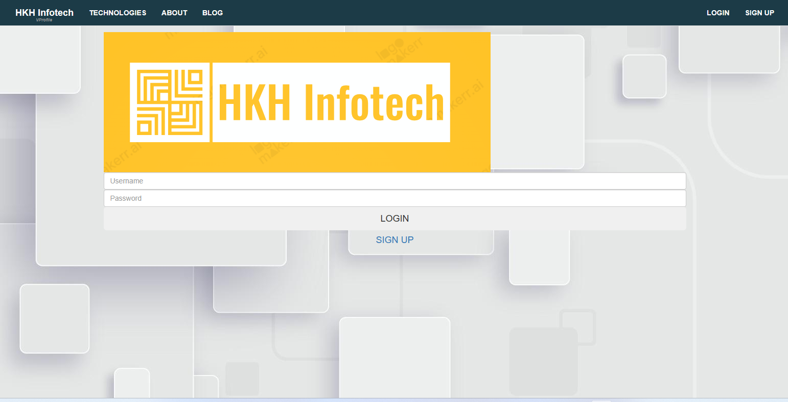

# Project-3:Lift&Shift Application Workflow to AWS

[*Project Source*](https://www.udemy.com/course/decodingdevops/learn/lecture/27976104#overview)

## Objective:
 * Flexible Infrastructure
 * No upfront cost
 * Modernize effectively
 * IAAC

## Prerequisites:
 * AWS Account
 * Registered DNS Name
 * Maven
 * JDK8
 * AWS CLI

## Flow of Execution:
 * Login to AWS account
 * Create key pairs
 * Create security groups
 * Launch instances with user data {Bash scripts}
 * Update IP to name mapping in route 53
 * Build Application from source code
 * Upload to s3 bucket
 * Download Artifacts to Tomcat EC2 instances
 * Setup ELB with HTTPS {Cert from Amazon certificate manager}
 * Map ELB endpoint to website name in Godaddy DNS
 * Verify


##### Architecture setup on AWS:


### Step-1: Create Security Groups for Services

- Create `vprofile-ELB-SG` first. We will configure `Inbound` rules to Allow both `HTTP` and `HTTPS` on port `80` and `443` respectively  from Anywhere `IPv4` and `IPv6`.


- Next we will create `vprofile-app-SG` , open port `8080` to accept connections from `vprofile-ELb-SG`.


- Finally,  create `vprofile-backend-SG`. WE need to open port `3306` for `MySQL`, `11211` for `Memcached` and `5672` for `RabbitMQ` server. We can check whcih ports needed fro aplication services to communicate each other from `application.properties` file under `src/main/resources` directory.We also need to open commucation `AllTraffic` from own SecGrp for backend services to communicate with each other.


### Step-2: Create KeyPair to Connect EC2 instances

- We will create a Keypair to connect our instances via SSH.


### Step-3: Provision Backend EC2 instances with UserData script

##### DB Instance:

- Create DB instance with below details.We will also add Inbound rule to `vprofile-backend-SG` for `SSH` on port `22`  from `MyIP` to be able to connect our db instance via SSH.
```sh
Name: vprofile-db01
Project: vprofile
AMI: Centos 9
InstanceType: t2.micro
SecGrp: vprofile-backend-SG
UserData: mysql.sh
```

##### Memcached Instance:

- Create Memcached instance with below details.
```sh
Name: vprofile-mc01
Project: vprofile
AMI: Centos 9
InstanceType: t2.micro
SecGrp: vprofile-backend-SG
UserData: memcache.sh
```

##### RabbitMQ Instance:

- Create RabbitMQ instance with below details.
```sh
Name: vprofile-rmq01
Project: vprofile
AMI: Centos 9
InstanceType: t2.micro
SecGrp: vprofile-backend-SG
UserData: rabbitmq.sh
```

##### Tomcat Instance:

- Create Tomcat instance with below details.
```sh
Name: vprofile-app01
Project: vprofile
AMI: Ubuntu 22.04
InstanceType: t2.micro
SecGrp: vprofile-app-SG
UserData: tomcat_ubuntu.sh
```


- Once the instances are ready, SSH into the db01 server and check if userdata script is executed. Also check status of mariadb.
```sh
ssh -i vprofile-prod-key.pem centos@<public_ip_of_instance>
sudo -i
systemctl status mariadb
curl http://169.254.169.254/latest/user-data
```


- SSH into the `mc01` server and check if userdata script is executed. Also check status of Memcached service and if it is listening on port `11211`.
```sh
ssh -i vprofile-prod-key.pem centos@<public_ip_of_instance>
sudo su -i
systemctl status memcached.service
ss -tunlp | grep 11211
```


- SSH into the rmq01 server and check if userdata script is executed. Check status of rabbitmq service.
```sh
ssh -i vprofile-prod-key.pem centos@<public_ip_of_instance>
sudo -i
curl http://169.254.169.254/latest/user-data
systemctl status rabbitmq-server
```


- SSH into the app01 server and check if userdata script is executed. Check status of Tomact9 service.
```sh
ssh -i vprofile-prod-key.pem ubuntu@<public_ip_of_instance>
sudo -i
systemctl status tomcat9
```


### Step-4: Create Private Hosted Zone in Route53 

- The backend stack is active and running.
- Create `vprofile.in` Private Hosted zone in Route53. choose `Default VPC` in `N.Virginia region`.


- Create records for the backend services. The purpose of this activity is we will use these record names in our `application.properties` file. Even if IP address of the    services change, the application won't need to change the config file.


### Step-5: Create Artifact Locally with MAVEN

- Clone the repository.
```sh
git clone https://github.com/hkhcoder/vprofile-project.git
```

- Before creating the artifact, Open Gitbash from Vscode, change the `application.properties` file under `/src/main/resources` directory with below lines.
```sh
jdbc.url=jdbc:mysql://db01.vprofile.in:3306/accounts?useUnicode=true&

memcached.active.host=mc01.vprofile.in

rabbitmq.address=rmq01.vprofile.in
```
- Go to `vprofile-project` root directory with Gitbash being the default terminal in vscode, execute the below command to create artifact`vprofile-v2.war`:

```sh
mvn install
```


### Step-6: Create S3 bucket using AWS CLI, copy artifact

- Upload our artifact to s3 bucket from AWS CLI and our Tomcat server will get the same artifact from s3 bucket.

- Create an IAM user for authentication to be used from AWS CLI.
```sh
name: vprofile-s3-admin
Access key - Programmatic access
Policy: s3FullAccess
```


- Configure our `aws cli` to use iam user credentials.
```sh
aws configure
AccessKeyID: 
SecretAccessKey:
region: us-east-1
format: json
```
- Create s3 bucket. 
- Note: S3 buckets are global so the naming must be UNIQUE!
```sh
aws s3 mb s3://vprofile-artifact-storage-rd 
```
- Go to target directory and copy the artifact to bucket with below command. Then verify by listing objects in the bucket.
```sh
aws s3 mb s3://ym-vprofile-arts
```
- Copy the artifact from the target directory to bucket with below command, then verify by listing objects in the bucket.
```sh
aws s3 cp vprofile-v2.war s3://ym-vprofile-arts
aws s3 ls ym-vprofile-arts
```

- Verify task from your S3 AWS Console.


### Step-7: Download Artifact to Tomcat server from S3

- In order to download our artifact onto Tomcat server, we need to create IAM role for Tomcat. Once role is created we will attach it to our `app01` server.
```sh
Type: EC2
Name: ym-vprofile-arts
Policy: s3FullAccess
```


- Before we login to our server, we need to add SSH access on port 22 to our `vprofile-app-SG`.

- Then connect to `app011` Ubuntu server.
```sh
ssh -i "vprofile-prod-key.pem" ubuntu@<public_ip_of_server>
sudo -i
apt update
systemctl status tomcat9
```
- Install `aws cli`, then copy the artifact to `/tmp` directory.
```sh
apt install awscli -y
aws s3 ls s3://ym-vprofile-arts
aws s3 cp s3://ym-vprofile-arts/vprofile-v2.war /tmp/
```
- To deploy this, we need to stop the tomcat9 service, remove the default application `/var/lib/tomcat9/webapps/ROOT`, then start the tomcat9 service.
```sh
systemctl stop tomcat9
rm -rf /var/lib/tomcat9/webapps/ROOT
cp  /tmp/vprofile-v2.war /var/lib/tomcat9/webapps/ROOT.war
systemctl start tomcat9
ls /var/lib/tomcat9/webapps/
```

- We can also verify `application.properties` file has the latest changes.
```sh
cat /var/lib/tomcat8/webapps/ROOT/WEB-INF/classes/application.properties
```

### Step-8: Setup LoadBalancer

- Before creating LoadBalancer , first we need to create Target Group.
```sh
Intances
Target Grp Name: vprofile-elb-TG
protocol-port: HTTP:8080
healtcheck path : /login
Advanced health check settings
Override: 8080
Healthy threshold: 3
available instance: app01 (Include as pending below)
```

- Now we will create our Load Balancer.
```sh
vprofile-prod-elb
Internet Facing
Select all AZs
SecGrp: vprofile-elb-secGrp
Listeners: HTTP, HTTPS
Select the certificate for HTTPS
```

### Step-9: Create Route53 record for ELB endpoint

- We will create an A record with alias to ALB so that we can use our domain name to reach our application.


- Lets check our application using our DNS. We can securely connect to our application!

  

### Step-10: Configure AutoScaling Group for Application Instances

- We will create an AMI from our App Instance.


- Next we will create a Launch template using the AMI created in above step for our ASG.
```sh
Name: vprofile-app-LT
AMI: vprofile-app-image
InstanceType: t2.micro
IAM Profile: ym-vprofile-arts
SecGrp: vprofile-app-SG
KeyPair: vprofile-prod-key
```


- Our Launch template is ready, now we can create our ASG.
```sh
Name: vprofile-app-ASG
ELB healthcheck
Add ELB
Min:1
Desired:2
Max:4
Target Tracking-CPU Utilization 50
```


- After terminating one of the  instances, the  ASG created a new instance using LT that we created.

### Step-11: Clean-up

- Delete all resources we created to avoid any charges from AWS.


